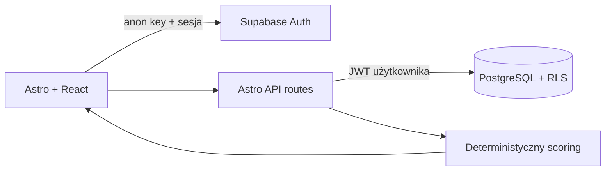

# AI Concept Compass

Polskojęzyczna aplikacja do kalibracji wiedzy przed AWS Certified AI
Practitioner. Użytkownik deklaruje pewność, odpowiada własnymi słowami, porównuje
odpowiedź ze wzorcem i otrzymuje deterministyczną rekomendację kolejnego tematu.

MVP celowo nie używa LLM. Jego wartość — wykrywanie luk mastery i nadmiernej
pewności — działa przewidywalnie, tanio i jest w pełni testowalna.

## Najważniejszy przepływ

```text
logowanie → pakiet 10 pojęć → pewność 1–5 → odpowiedź
→ samoocena wyniku → mastery + luka kalibracji → rekomendacja
```

Pakiet jest autorski i oparty na oficjalnym [AWS Certified AI Practitioner
Exam Guide](https://docs.aws.amazon.com/aws-certification/latest/ai-practitioner-01/ai-practitioner-01.html)
dla blueprintu AIF-C01 v1.1. Repozytorium nie zawiera skopiowanych pytań
egzaminacyjnych.

## Stack

- Astro 6 SSR, React 19, TypeScript i Tailwind CSS 4;
- hosted Supabase: PostgreSQL, Auth i Row Level Security;
- Cloudflare Workers;
- Zod 4, Vitest 4 i Playwright;
- GitHub Actions na Node 22.14.



Klucz `service_role` nie jest używany przez aplikację. Każdy zapis przekazuje
`user_id` zalogowanego użytkownika, a baza niezależnie wymusza ten sam warunek
przez RLS.

## Logika rekomendacji

- wynik: incorrect `0`, partial `50`, correct `100`;
- pewność: `(confidence - 1) × 25`;
- mastery: pierwszy wynik albo `0.6 × poprzednie + 0.4 × wynik`;
- nadmierna pewność: `max(0, pewność - wynik)`;
- powtórka: `+1`, `+3`, `+7`, a po dwóch poprawnych `+14` dni;
- priority: 70% luki mastery + 30% nadmiernej pewności + do 20 punktów
  przeterminowania, zawsze w zakresie 0–100;
- nowe pojęcie ma priorytet 100; terminy wymagające powtórki wygrywają przed
  samym wynikiem priority.

`now` jest przekazywane do funkcji domenowych, dzięki czemu testy nie zależą od
zegara systemowego.

## API

| Metoda               | Endpoint                    | Cel                               |
| -------------------- | --------------------------- | --------------------------------- |
| GET / POST           | `/api/concepts`             | lista i tworzenie pojęć           |
| GET / PATCH / DELETE | `/api/concepts/:id`         | odczyt, edycja i usunięcie        |
| POST                 | `/api/concepts/:id/reviews` | zapis oceny i scoring             |
| POST                 | `/api/starter-pack`         | idempotentne dodanie 10 szablonów |
| GET                  | `/api/dashboard`            | postęp domen i rekomendacja       |

Zapisy są walidowane przez Zod. Błędy mają wspólny format JSON i statusy
400/401/404/409/500.

## Uruchomienie

Wymagany jest Node 22.14 (`.nvmrc`) oraz projekt Supabase.

```bash
npm install
cp .env.example .env
```

W `.env` ustaw `SUPABASE_URL` i publiczny klucz anon/publishable
`SUPABASE_KEY`. Następnie połącz projekt i zastosuj migrację:

```bash
npx supabase login
npx supabase link --project-ref <project-ref>
npx supabase db push
npm run dev
```

Migracja `supabase/migrations/20260731190000_ai_concept_compass.sql` tworzy
tabele, polityki RLS, indeksy i pakiet 10 szablonów. Logowanie do Supabase jest
czynnością użytkownika; sekret dostępu nie trafia do repozytorium.

## Testy i bramki

```bash
npm run lint
npm run typecheck
npm run test:coverage
npm run build
```

Lokalny pakiet ma 42 testy i 100% pokrycia instrukcji, funkcji, linii oraz
gałęzi silnika scoringu. Test kontraktu migracji sprawdza RLS, cascade i
idempotencję.

E2E wymaga potwierdzonego konta testowego oraz zmiennych
`E2E_USER_EMAIL`/`E2E_USER_PASSWORD`:

```bash
npx playwright install chromium
npm run test:e2e
```

Setup Playwright loguje konto raz do `storageState` i czyści jego dane. Główny
scenariusz przechodzi przez prawdziwe auth, routing, API i bazę: pakiet → edycja
→ review → rekomendacja → usunięcie. Artefakty uwierzytelnienia są ignorowane
przez Git.

CI wymaga czterech sekretów repozytorium: `SUPABASE_URL`, `SUPABASE_KEY`,
`E2E_USER_EMAIL`, `E2E_USER_PASSWORD`. Oba joby — quality i E2E — są bramkami
merge.

## Wdrożenie na Cloudflare Workers

Po zalogowaniu do Cloudflare ustaw dwa sekrety i wdroż aplikację:

```bash
npx wrangler login
npx wrangler secret put SUPABASE_URL
npx wrangler secret put SUPABASE_KEY
npx wrangler deploy
```

Dodaj publiczny URL do listy dozwolonych redirect URL w Supabase Auth.

## Dokumentacja procesu

- [Shape notes](context/foundation/shape-notes.md)
- [PRD](context/foundation/prd.md)
- [Tech stack](context/foundation/tech-stack.md)
- [Test plan](context/testing/test-plan.md)
- [Audyt MVP](context/evidence/builder-mvp-check.md)

## Jak AI wspierało proces

Codex pomógł rozbić zakres na testowalne granice, przygotować migrację, API,
interfejs i testy oraz wykonywał każdą bramkę jakości. Reguły biznesowe, zakres
MVP, źródło treści i kryteria akceptacji pozostają jawne w repozytorium, zamiast
być ukryte w promptach lub wyniku modelu.

## Licencja

MIT
